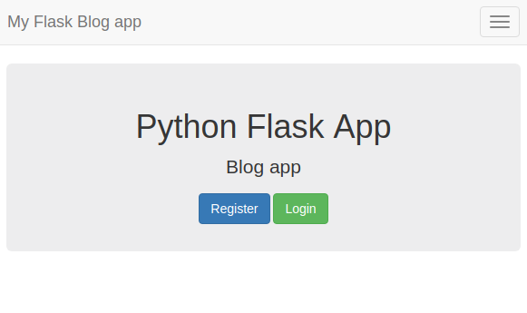
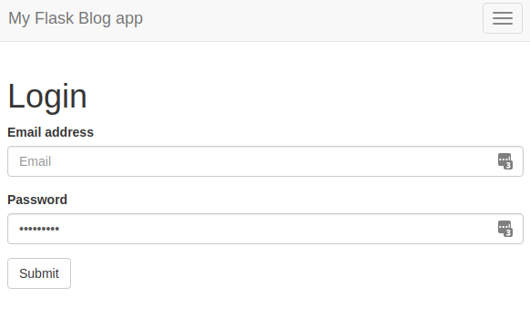
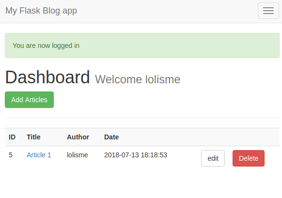
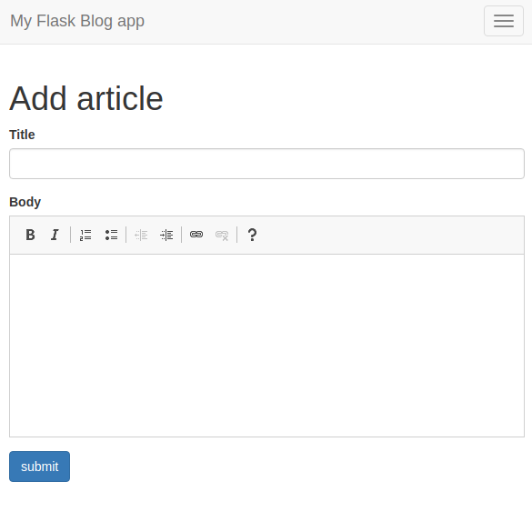

# Python Flask Blogging App
> A simple crud for blogging with authentication.

This is a repo for a Python Flask Blogging application.
 It includes the following features:

## HomePage 

## Authentication

## Dashboard

## Create new blog articles
#### It includes a functional TextArea from [CkEditor](https://ckeditor.com/)

## Release History
* 0.0.1
    * Work in progress

## Meta

Your Name – [@lolanismen](https://twitter.com/lolanismen)

[https://github.com/waracci](https://github.com/waracci/)

